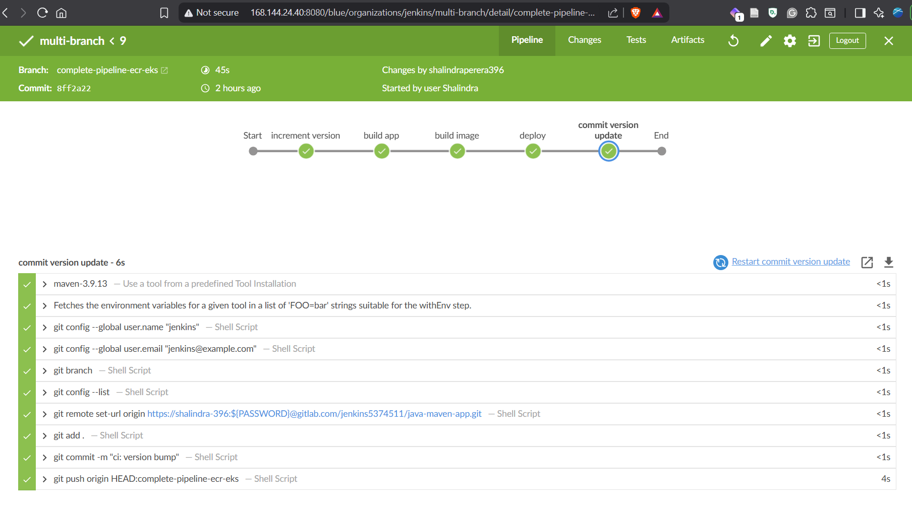
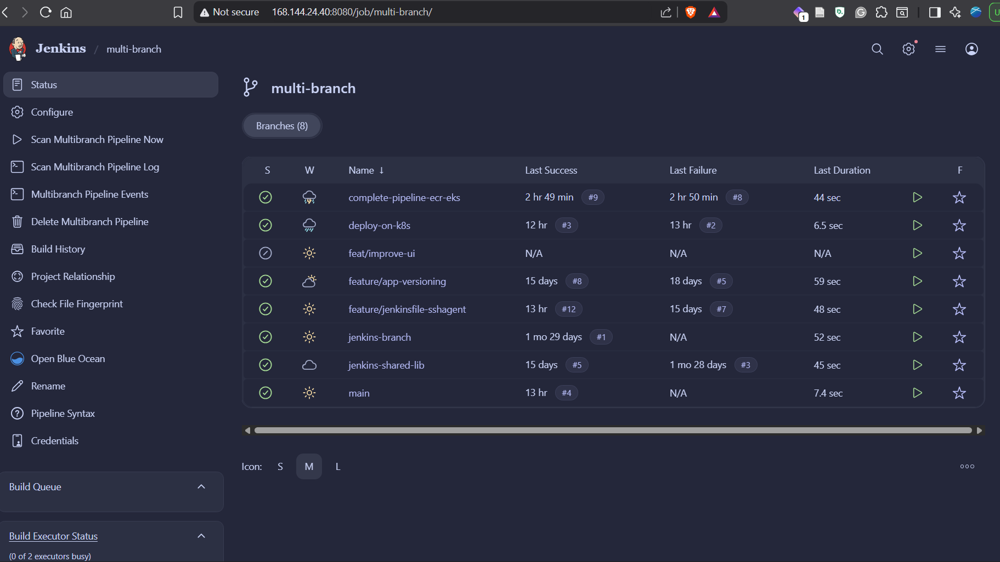

# 🚀 End-to-End CI/CD Pipeline: Jenkins, Docker, AWS, ECR, DockerHub, GitLab, Fargate, Maven

This repository demonstrates an end-to-end CI/CD pipeline for a Java Maven application. The flow covers build, test, containerization, image publishing, and Kubernetes deployment on AWS, with Jenkins orchestrating each stage.

---

## 🌿 Branch map (what each branch represents)

- `complete-pipeline-ecr-eks`: full CI/CD pipeline that builds, pushes to ECR, and deploys to EKS.
- `deploy-on-k8s`: Kubernetes deployment focus (manifests and `kubectl` apply).
- `feat/improve-ui`: UI updates for the static page in `src/main/resources/static/index.html`.
- `feature/app-versioning`: pipeline and app version bump strategy for image tagging.
- `feature/jenkinsfile-sshagent`: Jenkinsfile variant using an SSH agent to deploy the Maven Application to EC2 instance.
- `jenkins-branch`: experimental or training Jenkins pipeline variations.
- `main`: primary baseline and reference implementation.
- `Jenkins Shared Library`: reusable Jenkins pipeline code for common tasks , GitLab URL : https://gitlab.com/jenkins5374511/jenkins-shared-library

---

## 🧰 Stack and services

- Jenkins for pipeline orchestration
- Maven for build and test
- Docker for image packaging
- Amazon ECR for image registry
- DockerHub for optional public image publishing
- GitLab for source control and version bump commits
- Amazon EKS for Kubernetes deployment
- Fargate profiles and Auto Scaling Groups for workload execution and scaling

---

## 🔁 End-to-end pipeline flow

1. Source changes are pushed to the repository.
2. Jenkins pulls the branch and starts the pipeline.
3. Maven builds and tests the application.
4. Docker image is built and tagged with app version + Jenkins build number.
5. Image is pushed to Amazon ECR.
6. Kubernetes manifests are rendered and applied to EKS.
7. Pods run on Fargate profiles and scale via Auto Scaling Groups as needed.
8. The updated application version is committed back to GitLab.

---

## 🧪 Jenkins pipeline stages (mapped to Jenkinsfile)

- Increment version
  - Parses [pom.xml](pom.xml) and bumps the patch version.
  - Creates an image tag in the format `<version>-<BUILD_NUMBER>`.
- Build app
  - Runs Maven build and tests to produce the JAR.
- Build image
  - Builds the Docker image from [Dockerfile](Dockerfile).
  - Logs in to ECR and pushes the versioned image.
- Deploy
  - Uses environment substitution to render manifests.
  - Applies Kubernetes resources from [kubernetes/deployment.yaml](kubernetes/deployment.yaml) and [kubernetes/service.yaml](kubernetes/service.yaml).
- Commit version update
  - Commits the version change and pushes back to GitLab.

---

## ☁️ AWS setup and runtime behavior

- ECR stores all versioned container images published by Jenkins.
- EKS receives deployments and services applied by the pipeline.
- Fargate profiles run pods without managing EC2 nodes.
- Auto Scaling Groups provide additional capacity for workloads scheduled on node groups.

---

## 🐳 DockerHub publishing (optional)

DockerHub is not pushed by default in the current pipeline. If you want to publish to DockerHub as well:

- Add a DockerHub login and push stage in [Jenkinsfile](Jenkinsfile).
- Store DockerHub credentials in Jenkins and reference them in the pipeline.
- Tag the image for DockerHub alongside the ECR tag.

---

## 🧩 Jenkins tooling requirements

- Maven (configured tool: maven-3.9.13)
- Docker engine for build and push
- kubectl configured for the target EKS cluster
- envsubst installed on the Jenkins agent

---

## 🔐 Jenkins credentials required

- ecr-credentials for ECR login
- jenkins_aws_access_key_id and jenkins_aws_secret_access_key for AWS access
- gitlab-token for GitLab push of version bump commits

---

## 📁 Key configuration files

- [Jenkinsfile](Jenkinsfile)
- [Dockerfile](Dockerfile)
- [pom.xml](pom.xml)
- [kubernetes/deployment.yaml](kubernetes/deployment.yaml)
- [kubernetes/service.yaml](kubernetes/service.yaml)

---

## 🛠️ Build and run locally

### Build the JAR
```bash
mvn clean package
```

### Run locally
```bash
java -jar target/java-maven-app-*.jar
```

### Build the Docker image
```bash
docker build -t java-maven-app .
```

### Run the container
```bash
docker run --rm -p 8080:8080 java-maven-app
```

---

## ▶️ Running the pipeline

1. Create a Jenkins Pipeline job pointing to this repository.
2. Ensure the Jenkins agent has Docker, Maven, kubectl, and envsubst installed.
3. Configure the required credentials in Jenkins.
4. Trigger the pipeline and monitor each stage.

---

## 📝 Notes

- The app listens on port 8080.
- Each build generates a unique image tag using the Maven version and Jenkins build number.
- The pipeline pushes version updates back to GitLab after a successful deploy.

---
## Jenkins Pipeline in Server running on Digital Ocean Droplet


---
## Multi Branch Pipeline in Jenkins
