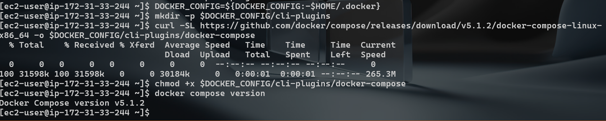
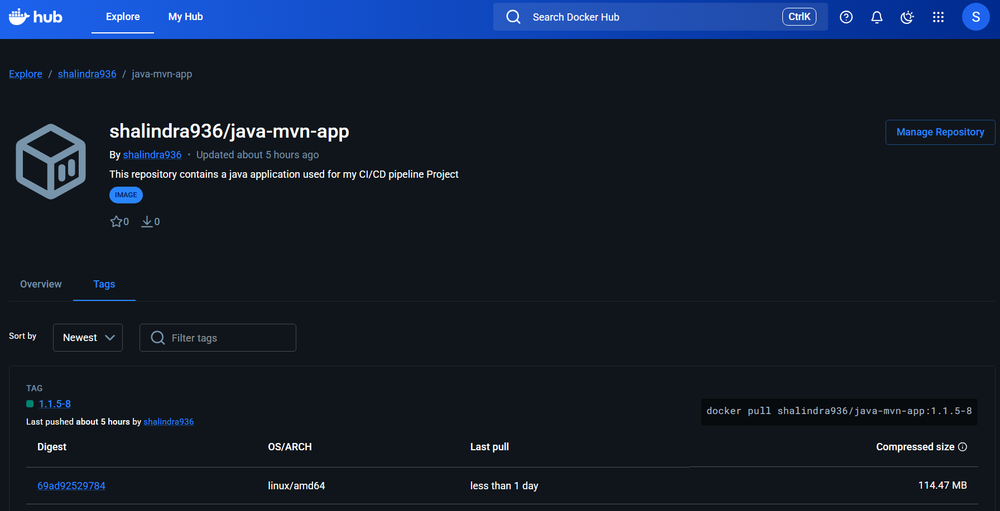
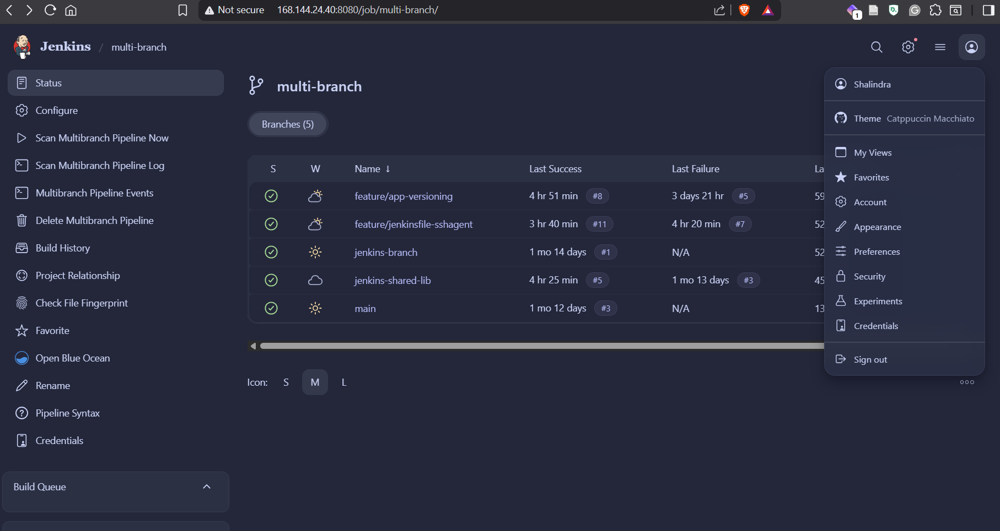
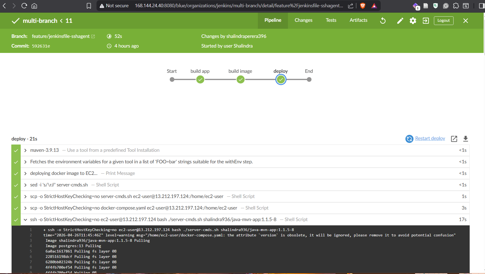
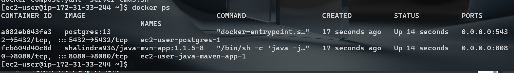
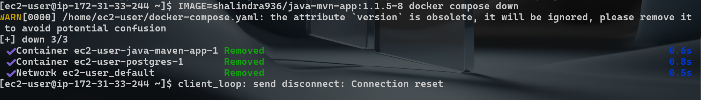

# DevOps Engineer Portfolio Project: Jenkins CI/CD 

This repository showcases a DevOps Engineer workflow for building, packaging, and deploying a Java application using Jenkins, Docker, and AWS EC2 with secure SSH credential management.

## Project Summary

- Builds a Java Spring Boot application with Maven
- Packages and pushes a Docker image to Docker Hub
- Deploys to an EC2 host using `sshagent` in Jenkins
- Starts services with Docker Compose on the target server

This project is designed to demonstrate the hands-on delivery and operations responsibilities expected from a DevOps Engineer in production-oriented environments.

## Steps that were executed

- Jenkins Declarative Pipeline design
- Reusable **Jenkins Shared Library** usage (`buildJar`, `buildImage`, `dockerLogin`, `dockerPush`)
- Secure deployment with Jenkins-managed SSH credentials (`ec2-server-key`)
- Automated remote deployment using `scp` + `ssh`
- Containerized application delivery using Docker and Docker Compose
- Release automation from source commit to runtime environment
- Infrastructure interaction and operational deployment execution on EC2

## Repository Structure

- `Jenkinsfile` – CI/CD pipeline (build, image, deploy)
- `pom.xml` – Maven project configuration
- `Dockerfile` – container build definition
- `docker-compose.yaml` – runtime services on server
- `server-cmds.sh` – remote deployment command wrapper
- `src/` – Java source code and test cases

## CI/CD Pipeline Flow

1. **Build App**  
   Jenkins builds the application JAR with Maven through shared library logic.

2. **Build & Push Image**  
   Jenkins builds Docker image `shalindra936/java-mvn-app:1.1.5-8`, logs in to Docker Hub, and pushes the image.

3. **Deploy to EC2 via SSH Agent**  
   Jenkins uses `sshagent(['ec2-server-key'])` to:
   - copy deployment files to EC2 (`server-cmds.sh`, `docker-compose.yaml`)
   - execute remote deployment commands
   - run Docker Compose with the selected image

## Deployment Model

- Remote host: EC2 Linux instance
- Authentication: Jenkins SSH credential (`ec2-server-key`)
- Runtime stack:
  - `java-maven-app` container on port `8080`
  - `postgres:13` container on port `5432`

## Local Validation

```bash
mvn clean verify
```
### Installing Docker Compose in ec2 Instance 


### Private Docker Repo where the Image was pushed through the App Versioning Branch Pipeline


### MultiBranch Pipeline View in Jenkins


### Pipeline Execution Success : Blue Ocean Plugin View


### Running Containers of Maven app and Postgres Database after the deployment


### Removing the contianers and free Up Space 
